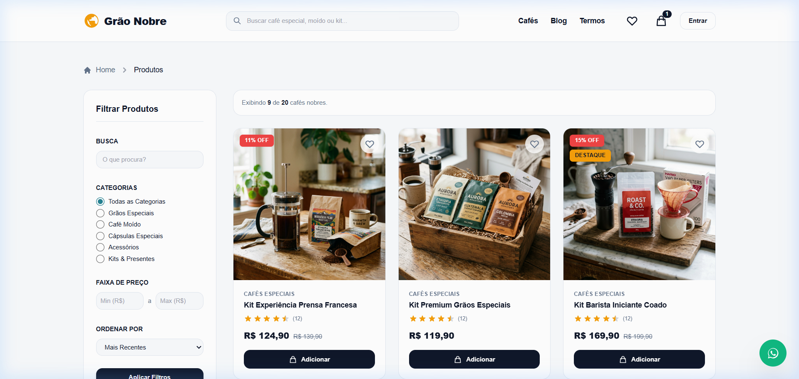
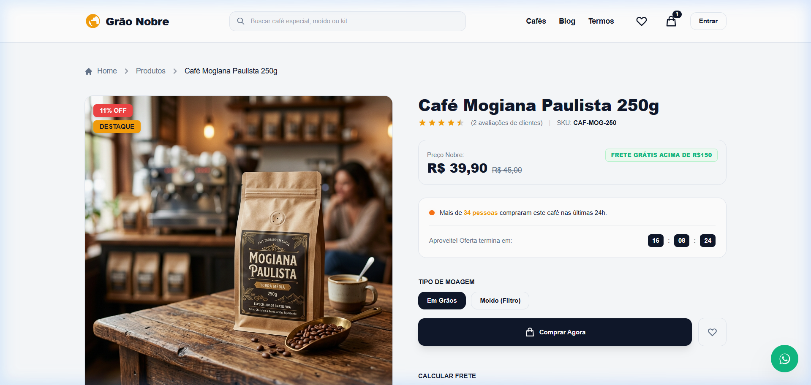
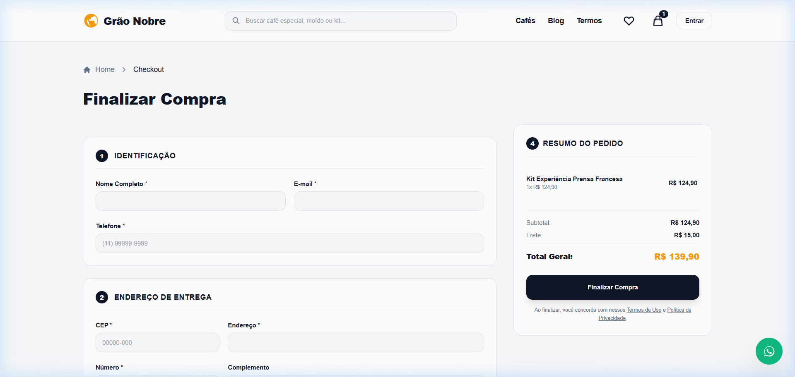

# ☕ Grão Nobre - E-Commerce de Cafés Especiais

> Uma plataforma de e-commerce premium (B2C) desenvolvida para a comercialização de cafés especiais 100% Arábica de alta qualidade e acessórios para baristas. A experiência do usuário foi planejada com riqueza estética, micro-animações, design responsivo de alta fidelidade e total conformidade com boas práticas de performance, SEO e segurança.

---

## 📸 Demonstração Visual (Screenshots)

### 🏡 Página Inicial (Home)


### 🛍️ Catálogo de Produtos


### 🔍 Detalhes do Produto & CRO (Otimização de Conversão)


### ⚡ Checkout em Etapa Única (com busca inteligente de CEP)


### 📝 Blog de Cafés & Conteúdo de Barista


---

## 🚀 Funcionalidades Principais

* **Carrinho de Compras & Lista de Desejos Dinâmicos**: Gerenciamento de estado rápido com persistência no local storage do cliente, gaveta lateral interativa (drawer) e contadores de itens em tempo real.
* **Checkout de Etapa Única (One-Page Checkout)**: Processo de finalização simplificado e seguro com suporte a Cartão de Crédito (validação Luhn local), PIX e Boleto Bancário.
* **Consulta de CEP Inteligente**: Integração com a API ViaCEP no backend para auto-preenchimento automático dos dados de entrega (rua, cidade, estado) com sistema de cache local em memória para minimizar requisições.
* **Otimização de Conversão (CRO)**: Selos de estoque crítico, prova social ("X pessoas compraram nas últimas 24h"), contadores regressivos de urgência e um popup inteligente de retenção (Exit Intent Popup) oferecendo descontos.
* **Blog de Conteúdo & SEO**: Área de artigos com SEO técnico otimizado (tags de título, meta descrições amigáveis, robots.txt automático e geração dinâmica de sitemap XML).
* **Painel Administrativo Completo**: Tela de gerenciamento interno para gerenciar cupons de desconto, acompanhar pedidos, cadastrar clientes e criar artigos no blog.
* **Suporte a PWA (Progressive Web App)**: Service Worker configurado com manifesto próprio para instalação do aplicativo em smartphones e navegação offline básica.

---

## 🛠️ Stack Tecnológica

* **Core Backend**: [Node.js](https://nodejs.org/) & [Express.js](https://expressjs.com/)
* **Banco de Dados & ORM**: [Sequelize ORM](https://sequelize.org/) rodando com [SQLite](https://www.sqlite.org/) (ideal para facilidade de desenvolvimento local)
* **Frontend Rendering**: [EJS (Embedded JavaScript templates)](https://ejs.co/) estruturado com layouts reutilizáveis (`express-ejs-layouts`)
* **Estilização**: [TailwindCSS](https://tailwindcss.com/) & PostCSS
* **Segurança**: [Helmet](https://helmetjs.github.io/) com política estrita de segurança de conteúdo (CSP), proteção anti-CSRF baseada em sessões com tokens criptográficos e limitadores de requisições ([express-rate-limit](https://www.npmjs.com/package/express-rate-limit)).

---

## ⚙️ Pré-requisitos & Instalação

### Instalação Local

1. **Requisitos Mínimos**: Instale o **Node.js (versão >= 20.0.0)** em seu computador.
2. **Clonar o Repositório**:
   ```bash
   git clone https://github.com/geraldocafe1/sitevendas.git
   cd sitevendas
   ```
3. **Instalar as Dependências**:
   ```bash
   npm install
   ```
4. **Configurar Variáveis de Ambiente**:
   Copie o arquivo `.env.example` e renomeie para `.env`. Configure a chave secreta e as demais credenciais caso queira testar integrações adicionais:
   ```bash
   cp .env.example .env
   ```
5. **Popular o Banco de Dados (Seeders)**:
   Gere as tabelas automaticamente no SQLite e insira os produtos premium e os posts de exemplo:
   ```bash
   npm run seed
   ```
6. **Compilar o CSS**:
   ```bash
   npm run build:css
   ```
7. **Iniciar o Servidor em Desenvolvimento**:
   ```bash
   npm run dev
   ```
   Abra seu navegador em [http://localhost:3000](http://localhost:3000) para ver o e-commerce em funcionamento!

---

### Executando com Docker

Se preferir rodar a aplicação em um container Docker isolado, utilize o comando:

```bash
docker-compose up --build
```
Ou por meio do script automatizado do projeto:
```bash
npm run docker:up
```

---

## 🔑 Contas de Teste (Banco Seeded)

Ao rodar o script de sementes (`npm run seed`), o banco de dados é populado com os seguintes usuários:

* **Administrador**:
  * **E-mail**: `admin@loja.com`
  * **Senha**: `admin123`
* **Cliente**:
  * **E-mail**: `joao@gmail.com`
  * **Senha**: `cliente123`
